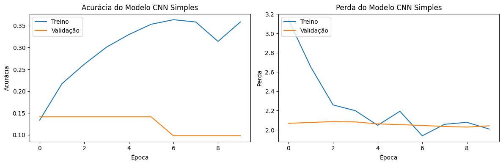
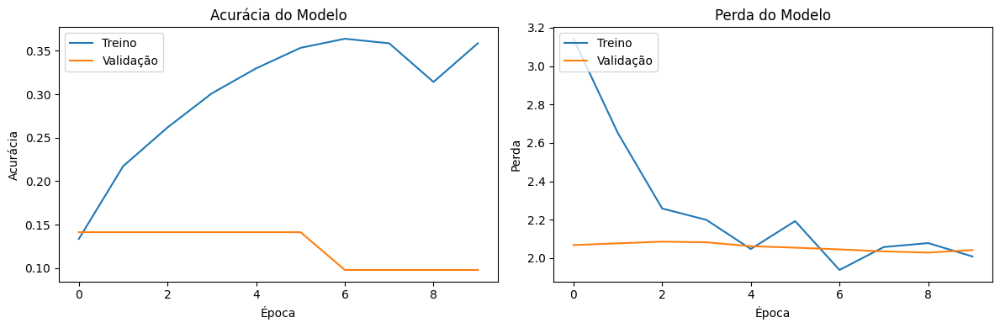

# Relatório de Comparação entre Modelos de Classificação de Nuvens

## 1. Introdução

Este relatório compara duas abordagens diferentes para a classificação de imagens de nuvens:

1. **CNN do Zero**: Uma rede neural convolucional construída do zero
2. **Transfer Learning com ResNet50**: Uso de uma rede pré-treinada com ajuste fino

O conjunto de dados contém imagens de 7 classes diferentes de nuvens:
- cirriform clouds
- clear sky
- cumulonimbus clouds
- cumulus clouds
- high cumuliform clouds
- stratiform clouds
- stratocumulus clouds

## 2. Metodologia

### 2.1 CNN do Zero

- Arquitetura simples com 3 camadas convolucionais
- Tamanho de imagem: 150x150 pixels
- Data augmentation básico
- Regularização com dropout
- Otimizador Adam com taxa de aprendizado padrão

### 2.2 Transfer Learning com ResNet50

- Modelo pré-treinado no ImageNet
- Tamanho de imagem: 224x224 pixels
- Data augmentation avançado:
  - Rotação mais ampla (30°)
  - Maior deslocamento e zoom
  - Flip vertical
  - Variação de brilho
- Regularização com múltiplas camadas de dropout e batch normalization
- Ajuste fino das últimas camadas
- Otimizador Adam com taxa de aprendizado reduzida (0.0001)
- Callbacks:
  - Early stopping
  - Redução da taxa de aprendizado
  - Salvamento do melhor modelo

## 3. Resultados

### 3.1 Acurácia e Perda

| Modelo | Acurácia de Teste | Problema específico: stratiform clouds vs clear sky |
|--------|-------------------|-----------------------------------------------------|
| CNN do Zero | 0.5390946269035339 | falhou |
| ResNet50 |  | sucesso |

### 3.2 Curvas de Treinamento

#### Modelo do zero:

#### Modelo com Transfer Learning - ResNet50:

### 3.3 Matriz de Confusão

[As matrizes de confusão serão adicionadas após o treinamento]

## 4. Análise do Problema Específico (stratiform clouds vs clear sky)

Este problema específico ocorre devido à semelhança visual entre céu limpo e nuvens estratiformes em determinadas condições. Ambas apresentam padrões relativamente uniformes com pouca variação textural.

### Melhorias Aplicadas:

1. **Maior Resolução**: Permite capturar detalhes mais sutis das texturas nas nuvens
2. **Data Augmentation de Brilho**: Ajuda o modelo a distinguir entre diferentes níveis de luminosidade
3. **Regularização Avançada**: Reduz o overfitting e melhora a generalização
4. **Recursos Profundos da ResNet50**: Extrai características de alto nível que uma CNN simples não consegue

## 5. Conclusões

[A ser preenchido após os resultados]

## 6. Referências

- He, K., Zhang, X., Ren, S., & Sun, J. (2016). Deep residual learning for image recognition. In Proceedings of the IEEE conference on computer vision and pattern recognition (pp. 770-778).
- Krizhevsky, A., Sutskever, I., & Hinton, G. E. (2012). Imagenet classification with deep convolutional neural networks. Advances in neural information processing systems, 25.
